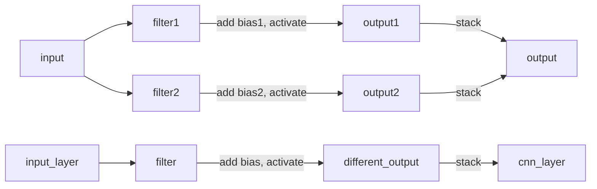
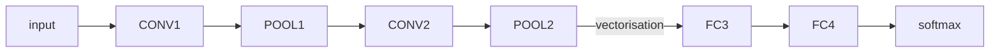
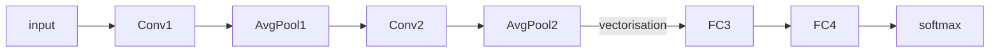
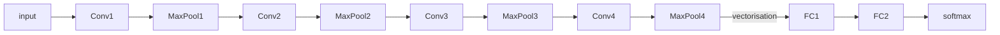
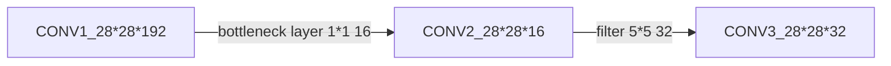
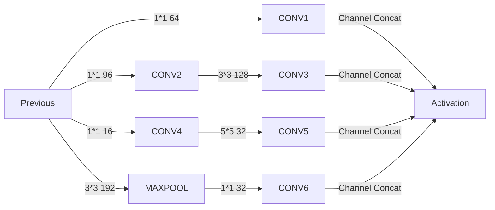
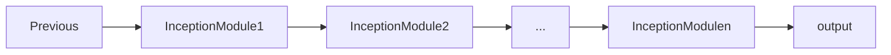

# Convolutional Neural Network

## Convolutional Neural Network

- input: $ n * n ​$
- filter: $ m * m ​$
  - cross-correlation
    - no flipping
    - used in deep learning
  - convolution
    -  flipping
    - double mirroring
    - used in mathematics
- output: $ (n - m + 1) * (n - m + 1) $

### filter

|              |              |              |
| ------------ | ------------ | :----------- |
| $ \omega 1 $ | $ \omega 2 $ | $ \omega 3 $ |
| $ \omega 4 $ | $ \omega 5 $ | $ \omega 6 $ |
| $ \omega 7 $ | $ \omega 8$  | $ \omega 9$  |

### Padding（填充）

- input: $ n * n ​$
- padding: $ p ​$
- filter: $ f * f $
  - m is odd
- output: $ (n + 2p - f + 1) * (n + 2p - f + 1) $

#### Valid Padding

no padding

#### Same Padding

the output size is the same as the input size after padding

- $ n = n + 2p - m + 1$

- $ p = \frac{m - 1}{2} $

### Stride（步长）

- input: $ n * n ​$
- padding: $ p ​$
- stride: s
- filter: $ f * f $
  - m is odd
- output: $ \left \lfloor \frac{(n + 2p - m)}{s} + 1 \right \rfloor * \left \lfloor  \frac{(n + 2p - m)}{s} / s + 1 \right \rfloor ​$
  - round down
  - floor of output

### Convolutions over volumes

channels: different color detectors

- input: $ h_i * w_i * c ​$
  - h: height
  - w: weight
  - c: channel / depth
- padding: $ p ​$
- stride: s
- filter: $ h_f * w_f * c ​$
  - h: height
  - w: weight
  - c: channel / depth
- output: $ \left \lfloor \frac{(n + 2p - f)}{s} + 1 \right \rfloor * \left \lfloor  \frac{(n + 2p - f)}{s} / s + 1 \right \rfloor * n_f​$
  - $ n_f ​$: number of filters
    - detect different features

## Layer

- Convolution (Conv)
- Pooling (POOL)
- Fully Connected (FC)

### Convolution Layer (CONV)

#### Hyperparameters

- input: $ n ^{[i-1]} _{h} * n ^{[i-1]}_{w} * n_c^{[i-1]} $

- filter: $ f^{[i]} * f^{[i]} * n_c^{[i-1]} $
- padding: $ p^{[i]} * p^{[i]} ​$

- Stride: $ s^{[i]} * s^{[i]} ​$

- output: $ n ^{[i]} _{h} * n ^{[i]}_{w} * n_c^{[i]} ​$
  - number of filters: $ n_c^{[i]} $
    - bias: $ n_c^{[i]} ​$
  - $n ^{[i]}_h = \left \lfloor \frac{(n ^{[i-1]} _{h} + 2p^{[i]} - f{[i]})}{s^{[i]}} + 1 \right \rfloor ​$
  - $ n ^{[i]}_w = \left \lfloor \frac{(n ^{[i-1]} _{w} + 2p^{[i]} - f{[i]})}{s^{[i]}} + 1 \right \rfloor ​$
  - $ n_c^{[i]} $

### Pooling Layer (POOL)

- static computation
- no backpropagation

#### Categories

- Max Pooling
  - max operation: keep the max number

- Average Pooling
  - average operation: compute the average

#### Hyperparameters

- filter: $ f^{[i]} * f^{[i]} * n_c^{[i-1]} $
  - usually 2, 3
- Stride: $ s^{[i]} * s^{[i]} ​$
  - usually 2
- padding: $ p^{[i]} * p^{[i]} $
  - usually 0

### Fully Connected (FL)

## Case

### Classic Networks

#### LeNet-5

- approximately 60 thousand parameters
- activation after pooling

#### AlexNet

- approximately 60 million parameters
- relu activation

#### VGG-16

##### Process

- input: 224 * 224 * 3 --> Conv64 (* 2): 224 *224 * 64
- --> MaxPool: 112 * 112 * 64
- --> Conv128 (* 2): 112 *112 * 128
- --> MaxPool: 56 * 56 * 128
- --> Conv256 (* 3): 56 * 56 * 256
- --> MaxPool: 28 * 28 * 256
- --> Conv512 (* 3): 28 * 28 * 512
- --> MaxPool: 14 * 14 * 512
- --> Conv512 (* 3): 14 * 14 * 512
- --> MaxPool: 7 * 7 * 512
- --> FC: 4096
- --> FC: 4096
- --> Softmax: 1000

##### Pros

- the rate of shrinking images and increasing channels is systematic

### Residual Network

#### Residual Block

##### Plain Network

- "main path"
- $ a^{[l]} $ -> activation -> $ a^{[l + 1]} $ -> activation -> $ a^{[l + 2]} $ -> ...

##### Residual Network

- "short cut" / "skip connection"
- $ a^{[l + 2]}  = g( z^{[l + 2]} + a^{[l]} )$

### Inception

#### 1 * 1 Convolution

- traverse all positions with a 1 * 1 filter
- shrink the channel when large
  - from n_c to n_f
- save computation
- learn more the complex function of your network
- as bottleneck layer

#### Inception Block

- automatically choose filter size
  - size of filters
  - number of filters
- automatically choose filter type (CONV or POOL)

#### Inception Module

#### Incepution Network

### Transfer Learning

- pre-training/pre-initialize low-level features
- fine tuning / retrain

#### retrain

- just retrain the weights of the last layer
- retrain all the layers if you have enough data

#### Usage

- low level features from the previous could be helpful for the current
- tasks have the same type of input
- have 
  - more data for the the problem transfer from
  - less data for the problem transfer to

### Data Augmentation

#### Common Method

- Mirroring
-  Random Cropping
- Rotation
- Shearing
- Local Warping

#### Color Shifting

- adjust R, G, B 
- PCA color augmentation

