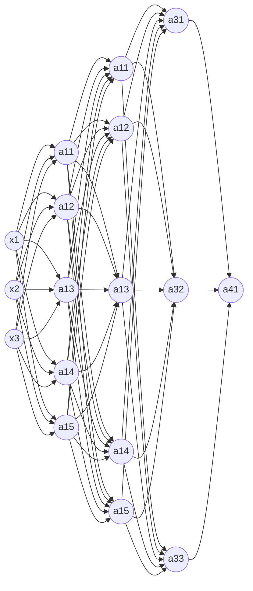

# Neural Network

## Neural Network

input layer (layer 0) $->$ hidden layer (layer 1) $->$ ... $->$ hidden layer (layer n -1) $->$ output layer (layer n)

### Chain Rule

$u = 4 x $ -> $ v = u + a $ -> $ y = 3 v ​$

$ \frac{d y}{d v} = 3 $ , $ \frac{d y}{d u} = \frac{d y}{d v} \frac{d v}{d u} = 3 $, $ \frac{d y}{d x} = \frac{d y}{d v} \frac{d v}{d u} \frac{d u}{d x} = 12 ​$

### Activation Function

- Sigmoid function: $\sigma(z) = \frac{1}{1+e^{-z}}​$

  - $\sigma(z)' =  \frac{d}{d z} \sigma(z)  = \frac{1}{1+e^{-z}}(1 - \frac{1}{1-e^{-z}})  = g(z) (1 - g(z)) = a (1 - a)​$

  - only used in binary classification

- tanh function: $tanh(z) = \frac {e^z - e^{-z}} {e^z + e^{-z}}​$
  - $tanh(z)' = \frac{d}{d z} tanh(z) = 1 - (tanh(z)) ^ 2​$

- ReLU function: $g(z) = max(0, z)​$
  - $g(z)' =  0​$ if z < 0
  - $g(z)' =  1​$ if z > 0
  - $g(z)' = undefined ​$ if z = 0
  - ReLU: rectified linear unit 
  - z < 0, a = 0
  - z = 0, a = z

- Leaky ReLU function: a = max(cz, z)
  - $g(z)' =  c$ if z < 0
  - $g(z)' =  1$ if z > 0
  - $g(z)' = undefined $ if z = 0
- 
  - c is very small
- identity activation function: a = z
  - useless

### Gradient Descent

Repeat:

​	$\omega ^ {[i]} = \omega ^ {[i]} - \alpha * \frac{\partial}{\partial\omega ^ {[i]}}J ​$

​	$\beta ^ {[i]} = \beta ^ {[i]} - \alpha * \frac{\partial}{\partial\beta ^ {[i]}}J $

- initialize the parmeters randomly
  - $ \omega^{[i]} = $ np.random.randn ((n,m)) * 0.01
  - $ \beta{[i]} = ​$ np.zero ((n,1))

#### Forward Propagation

input: $ a^{[i-1]} $

output: $ a^{[i]} ​$, cache $ z^{[i]} ​$

- $A^{[0]} = X​$
- $Z^{[i]} = \omega^{[i]} A^{[i - 1]} + \beta^{[i]}  ​$
- $A^{[i]} = g^{[i]} (Z^{[i]}) $
- $ \hat{Y} = A^{[l]} $

#### Back Propagation

input: $ d a^{[i]} $

output: $ d a^{[i-i]} , d \omega^{[i]}, d \beta^{[i]} ​$

- $ dZ^{[i]} = A^{[i]} - Y ​$
- $ d\omega^{[i]} = \frac{1}{m} dZ^{[i]} A^{[i-1]T} ​$
- $d b^{[i]} = \frac{1}{m} np.sum(dZ^{[i]}, axis = 1, keepdims = True) $ 
- $da^{[i-1]} = \omega ^ {[i]T} dz^{[i]} $

### Weight Initialization

- variance($ \omega_i $) = $ \frac{1}{n} $
  - prevent z blow up or too small
  - n is the number of input features

- $ \omega{[i]} $ = np.random.randn(shape) * np.sqrt($ \frac{2}{n^{[i-1]}} ​$)
  - ReLU activation
- $ \sqrt{\frac{2}{n^{[i-1]} + n ^{[i]}}} $
  - tanh activation

### Cost Function

$ J( \omega ^{[1]}, \beta^{[1]}, ..., \omega^{[L]}, \beta^{[L]}) = \frac{1}{m} \sum_{i=1}^m l(\hat{y^i}, y^i) ​$

#### Regularization

##### L2 Norm

$ J( \omega ^{[1]}, \beta^{[1]}, ..., \omega^{[L]}, \beta^{[L]}) = \frac{1}{m} \sum_{i=1}^m l(\hat{y^i}, y^i) + \frac{\lambda}{2m}\sum_{l=1}^L| |\omega^{[l]}||^2 $

$ || \omega^{[l]} || ^2 = \sum_{i=1}^{n^{[l-1]}} \sum_{j=1}^{n^{[l]}} (\omega_{ij}^{[l]})^2 ​$

- $ \omega : (n^{i-1}, n^{i}) $

- Frobenius Norm

##### Dropout Regularization

Intuition: Cannot rely on any one feature, so have to spread out weights

parameter:

- keep_prob for different layers
  - the chance of keeping a unit in each layer
  - keep_prob = 1: keep all units

## Deep Neural Network

- $l$ = 4​ (hidden layers and output layer)
- $n^{[i]}​$ = units in layer i
  - $n^{[1]}$ = 5, $n^{[2]}$ = 5, $n^{[3]}$ = 3, $n^{[4]}$ = $n^{[l]}$ = 1, $n^{[0]}$ = $n_x$ = 3
- $a^{[i]}$ = activations in layer i
- $z^{[i]}$ = cache in layer i (before being put in activation function)

### Parameters

#### Hyperparameters

Contrul the ultimate parameters $ \omega $ and $ \beta $

- learning rate $ \alpha $
- iterations of gradient descent
- number of hidden layers
- number of hidden units
- choice of activation function

#### Parameters

- $ \omega $
- $ \beta $

### Forward Propagation

input: $ a^{[i-1]} $

output: $ a^{[i]} $, cache $ z^{[i]} $

- $A^{[0]} = X$
- $Z^{[i]} = \omega^{[i]} A^{[i - 1]} + \beta^{[i]}  $
- $A^{[i]} = g^{[i]} (Z^{[i]}) ​$
- $ \hat{Y} = A^{[l]} ​$

### Backward Propagation

input: $ d a^{[i]} ​$

output: $ d a^{[i-i]} , d \omega^{[i]}, d \beta^{[i]} ​$

- $ dZ^{[i]} = dA^{[i]} g^{[i]'} (Z{[i]}) ​$
- $ d\omega^{[i]} = \frac{1}{m} dZ^{[i]} A^{[i-1]T} $
- $d b^{[i]} = \frac{1}{m} np.sum(dZ^{[i]}, axis = 1, keepdims = True) ​$ 
- $da^{[i-1]} = \omega ^ {[i]T} dz^{[i]} ​$

### Dimension

#### Single Example

- $A^{[0]} = X$
  - $ X ​$: ($ n^{[i]}, 1 ​$)
- $Z^{[i]} = \omega^{[i]} A^{[i - 1]} + \beta^{[i]}  ​$
  - $\omega^{[i]}$ : ( $ n^{[i]}, n^{[i-1]} ​$ )
  - $\beta {[i]}​$ : ( $ n^{[i]}, 1 ​$ )
- $A^{[i]} = g^{[i]} (Z^{[i]}) $
  - $ Z^{[i]} ​$:  ($ n^{[i]}, 1 ​$)
- $ \hat{Y} = A^{[l]} ​$

#### Vectorization

- $ A^{[0]} = X $
  - $ X $: ($ n^{[i]}, m $)

- $ Z^{[i]} = \omega^{[i]} A^{[i - 1]} + \beta^{[i]} $
  - $ Z^{[i]} = [Z^{[i](1)}, Z^{[i](2)}, ... , Z^{[i](m)}] $
  - $ Z^{[i]} $:  ($ n^{[i]}, m $)
  - $\beta {[i]}$ : ( $ n^{[i]}, 1 $ ) -- Broadcast -- > $\beta {[i]}$ : ( $ n^{[i]}, m $ )

### Circuit Theory

Small L-layer deep neural network require exponentially more hidden units to compute.